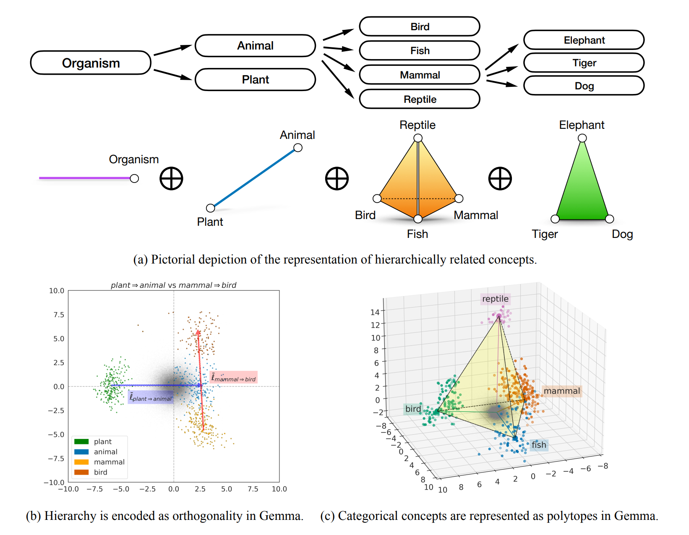
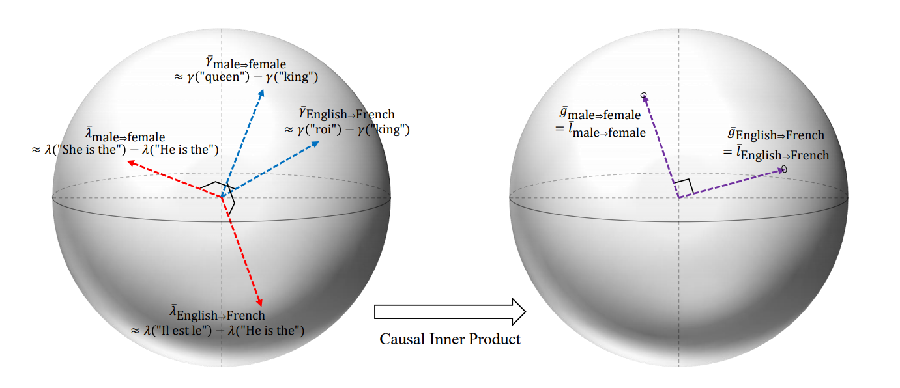
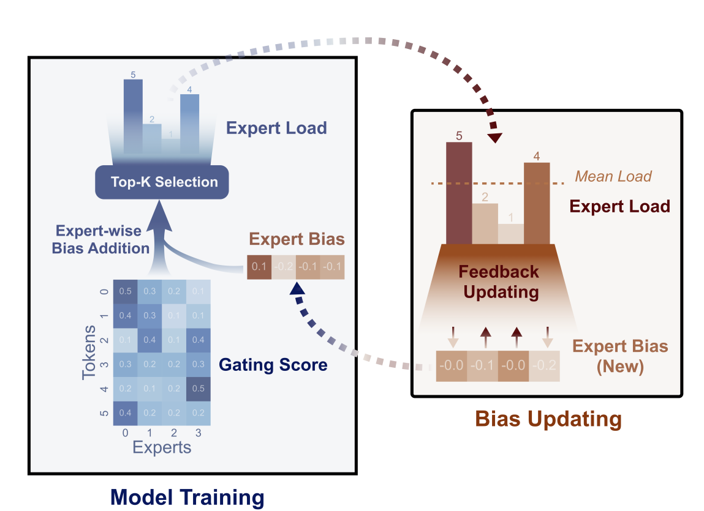

# AI Research Monthly Wrap

  
    2025 Feb
  

  <button @click="$slidev.nav.openInEditor" title="Open in Editor" class="slidev-icon-btn">
    <carbon:edit />
  </button>
  <a href="https://github.com/github/seonglae/monthly-ai" target="_blank" class="slidev-icon-btn">
    <carbon:logo-github />
  </a>

---
layout: two-cols-header
---

# [The Geometry of Categorical and Hierarchical Concepts in Large Language Models](https://arxiv.org/pdf/2406.01506) (Park et al., 2024)

::left::

::right::

[Linear Representation Hypothesis  and the Geometry of Large Language Models](https://openreview.net/pdf?id=T0PoOJg8cK) (Park et al., 2023)

- *Causal Inner product* instead of Euclidean inner product
- When vectors are randomly placed in high-dimensional space, they tend to be mostly orthogonal to each other, which may not accurately reflect their semantic relationships
- *Causal Inner product* redefines inner product so that causally separated (independent) features are orthogonal to each other

---

# [Native Sparse Attention](https://arxiv.org/pdf/2502.11089) (Deepseek team, 2025)
1. fine-grained token selection
2. coarse-grained token compression ([Contextual Compression](https://www.notion.so/Contextual-Compression-cbbf6f3c7e684578994dfc5e81d6030c?pvs=21) aware sparse attention)

---

# [Multimodal Neuron](https://distill.pub/2021/multimodal-neurons/) (Goh et al., 2021)

In 2005, a letter published in Nature described human neurons responding to specific people, such as Jennifer Aniston or Halle Berry. The exciting thing was that they did so regardless of whether they were shown photographs, drawings, or even images of the person’s name. The neurons were multimodal. You are looking at the far end of the transformation from metric, visual shapes to conceptual information.

---
# [How to Use t-SNE Effectively](https://distill.pub/2016/misread-tsne/) (Wattenberg et al., 2016)

---
# [SFT Memorizes, RL Generalizes](https://arxiv.org/pdf/2501.17161) (Chu et al., 2025)

---
# [Auxiliary-Loss-Free Load Balancing](https://arxiv.org/pdf/2408.15664) (Deepseek team, 2024)

- MoE Node-Limited Routing 

---
# [Delta Action Learning](https://arxiv.org/pdf/2502.01143) (He et al., 2025)

---
css: styles.css
---

